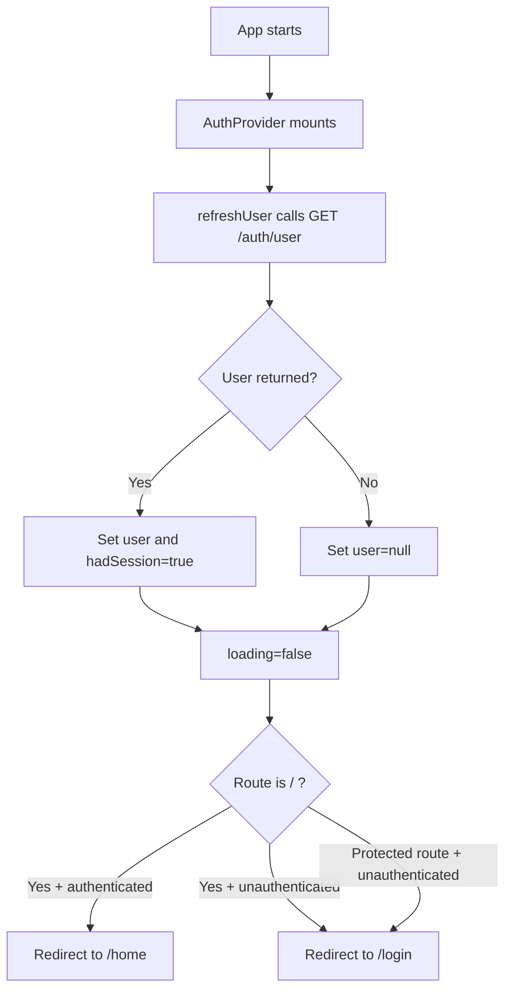

# Frontend Documentation

This frontend is a React + Vite authentication client that uses cookie-based sessions from the backend API.

## What This Frontend Does

- Handles registration, login, logout, and session restoration.
- Protects authenticated routes (`/home`) with route guards.
- Supports forgot-password and reset-password flows.
- Shows global toast feedback for success and error states.
- Uses a centralized Axios client with 401 handling.

## Tech Stack

- React 19
- Vite 7
- React Router 7
- Axios
- Tailwind CSS 4
- React Toastify
- React Icons
- React Spinners

## Prerequisites

- Node.js 18+
- npm
- Backend API running and reachable

Default API base URL fallback:

`http://localhost:5000/api`

## Setup

```bash
cd frontend
npm install
```

## Environment Variables

Create `frontend/.env` or `frontend/.env.local`:

```env
VITE_API_BASE_URL=http://localhost:5000/api
```

`src/api/client.js` uses this value for Axios `baseURL`.

## Scripts

- `npm run dev`: start Vite dev server
- `npm run build`: create production build
- `npm run preview`: serve production build locally
- `npm run lint`: run ESLint

## High-Level Architecture

Startup and providers:

1. `src/main.jsx` mounts app with:
   1. `<BrowserRouter>`
   2. `<AuthProvider>`
   3. `<App />`
2. `src/App.jsx` defines route table and mounts `<ToastContainer />`.

Auth state management:

- `src/auth/AuthContext.jsx`: React context.
- `src/auth/useAuth.js`: safe hook wrapper, throws if used outside provider.
- `src/auth/AuthProvider.jsx`: source of truth for auth state and auth actions.

Networking:

- `src/api/client.js`: shared Axios instance + response interceptor.
- `src/api/auth.js`: auth endpoint wrapper functions.

Route protection:

- `src/auth/RequireAuth.jsx`: blocks protected routes for unauthenticated users.
- `src/routes/HomeRedirect.jsx`: root route (`/`) redirect logic.

## Routing Map

Defined in `src/App.jsx`:

- `/` -> `HomeRedirect`
- `/login` -> `Login` (public)
- `/register` -> `Register` (public)
- `/forgot-password` -> `ForgotPassword` (public)
- `/reset-password` -> `ResetPassword` (public)
- `/home` -> `Home` (protected by `RequireAuth`)
- `*` -> `NotFound`

## Core Logic Flow

### 1. App bootstrap and session restore

Implemented in `src/auth/AuthProvider.jsx`:

1. On mount, provider sets `loading = true`.
2. Calls `refreshUser()`.
3. `refreshUser()` calls `authApi.me()` (`GET /auth/user`).
4. If backend returns a user, provider sets:
   - `user` object
   - `hadSessionRef.current = true`
   - `unauthorizedHandledRef.current = false`
5. If request fails, provider sets `user = null`.
6. Provider sets `loading = false`.

Impact on routes:

- During bootstrap, `RequireAuth` and `HomeRedirect` render `Loader`.
- After bootstrap:
  - Authenticated users can access `/home`.
  - Unauthenticated users are redirected to `/login` for protected routes.

### 2. Login flow

From `src/pages/Login.jsx` and provider methods:

1. User submits email/password/remember.
2. `login(form)` in provider calls `authApi.login(...)` (`POST /auth/login`).
3. Backend sets HttpOnly session cookie.
4. Provider immediately calls `refreshUser()` to hydrate `user` state.
5. UI shows success toast and navigates to:
   - `location.state.from.pathname` when redirected from a protected route, or
   - `/home` by default.

### 3. Register flow

From `src/pages/Register.jsx`:

1. User enters email/password/confirm password.
2. Client validates password match before API call.
3. Calls `register(form)` -> `POST /auth/register`.
4. On success, shows toast and redirects to `/login`.

### 4. Forgot password flow

From `src/pages/ForgotPassword.jsx`:

1. User submits email.
2. Calls `forgotPassword(email)` -> `POST /auth/password/forgot`.
3. UI always shows the same success toast even on failure.

Reason: avoids user/email enumeration by not revealing account existence.

### 5. Reset password flow

From `src/pages/ResetPassword.jsx`:

1. Reads token from query param: `?token=...`.
2. Validates token exists before submit.
3. Validates password and confirm password match.
4. Calls `resetPassword(token, password)` -> `POST /auth/password/reset`.
5. On success, shows toast and redirects to `/login`.

### 6. Logout flow

From `src/components/SimpleNav.jsx` and provider:

1. Logout button calls provider `logout()`.
2. Provider calls `POST /auth/logout`.
3. In `finally`, provider always clears local user state and navigates to `/login`.
4. Toast indicates logout result.

## Logic Flow Diagrams (Mermaid)

### App bootstrap and initial routing



## API Layer Details

### `src/api/auth.js`

Available methods:

- `register(email, password)`
- `login(email, password, remember)`
- `logout()`
- `me()`
- `forgotPassword(email)`
- `resetPassword(token, password)`

### `src/api/client.js`

Axios client config:

- `baseURL`: `VITE_API_BASE_URL` or `http://localhost:5000/api`
- `withCredentials: true` (required for cookie auth)
- JSON content headers

Response interceptor behavior:

- Success path returns `response.data` directly.
- Error path normalizes rejects into:
  - `status`
  - `message`
  - `data`

401 handling logic:

- Global 401 handling is skipped for selected auth/public paths.
- Other 401s trigger `triggerUnauthorized(...)` once (guarded).
- Message is adjusted for token-expired case.

## Unauthorized Event Flow

Files:

- `src/auth/authEvents.js`
- `src/auth/AuthProvider.jsx`

Mechanism:

1. `AuthProvider` registers one unauthorized handler via `setUnauthorizedHandler`.
2. Axios interceptor (`client.js`) calls `triggerUnauthorized` on relevant 401s.
3. Provider handler decides whether to act:
   - Ignore during bootstrap loading.
   - Ignore if no prior session existed (`hadSessionRef` false).
   - If a session existed and is now invalid, clear user, toast, and redirect `/login`.

This prevents repeated redirect/toast loops from multiple failing requests.

## Route Guard Behavior

### `src/auth/RequireAuth.jsx`

- If `loading` true: render `Loader`.
- If not authenticated: redirect `/login` and keep original location in `state.from`.
- If authenticated: render child route via `<Outlet />`.

### `src/routes/HomeRedirect.jsx`

- Used on `/`.
- If loading: render `Loader`.
- If authenticated: redirect `/home`.
- Else: redirect `/login`.

## Page-Level Summary

- `src/pages/Login.jsx`
  - Redirects authenticated users away from login.
  - Includes remember-me checkbox and forgot-password link.

- `src/pages/Register.jsx`
  - Redirects authenticated users away from register.
  - Includes client-side password strength hints and confirm check.

- `src/pages/ForgotPassword.jsx`
  - Generic success response for both success/failure states.

- `src/pages/ResetPassword.jsx`
  - Token-from-query based reset form with validation.

- `src/pages/Home.jsx`
  - Protected page showing authenticated user email.

- `src/pages/NotFound.jsx`
  - Catch-all 404 UI with link back to `/`.

## Layout and Shared UI

- `src/components/FormLayout.jsx`: centered card layout for auth forms.
- `src/components/PageLayout.jsx`: wrapper for authenticated pages (nav, main, footer).
- `src/components/SimpleNav.jsx`: includes logout action.
- `src/components/Footer.jsx`: footer text.
- `src/components/Loader.jsx`: reusable loading screen.

## Styling and Build Configuration

- `src/index.css` imports Tailwind: `@import "tailwindcss";`
- `vite.config.js` enables React and Tailwind Vite plugins.
- `eslint.config.js` applies JS + React hooks + Vite refresh lint rules.

## Expected Backend Contract

Based on frontend usage, backend should provide:

- `POST /auth/register`
- `POST /auth/login`
- `POST /auth/logout`
- `GET /auth/user`
- `POST /auth/password/forgot`
- `POST /auth/password/reset`

And should support:

- Cookie-based sessions (`withCredentials`)
- CORS allowing frontend origin with credentials
- JSON error response with `message` or `error`

## Troubleshooting

If auth flow does not work:

1. Confirm `VITE_API_BASE_URL` points to the correct backend.
2. Confirm backend CORS includes frontend origin and credentials.
3. Confirm browser is accepting backend cookies.
4. Inspect network responses for normalized error shape (`status`, `message`, `data`).
5. Verify reset token is present in URL query string for `/reset-password`.
